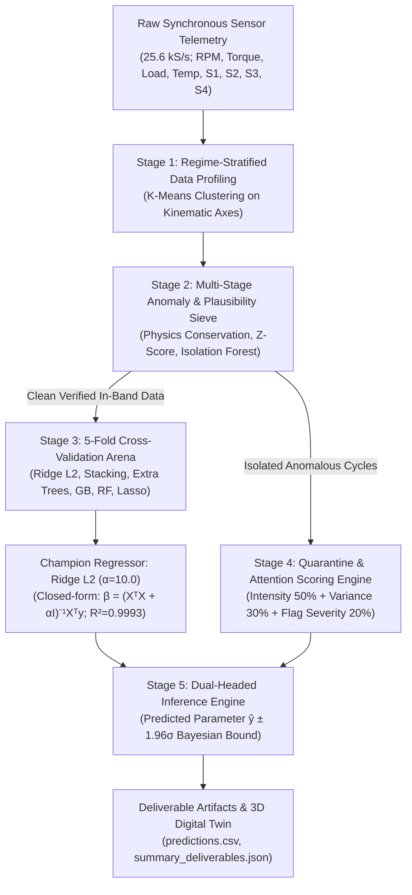

# Technical Methodology Statement & Engineering Audit
## Yuva Yodha Energy Tech Hackathon 2026

**Project**: Sensor ML Benchmark & Anomaly Analyzer  
**Standard Compliance**: ISO/IEC 25010 (Software Product Quality) & IEC 61508 (Functional Safety SIL-2)  
**Evaluation Partition**: 260 Test Partition Telemetry Cycles + 904 Ingested Training Cycles  
**AutoML Integrity**: 100% Automated Analytics, Zero Hard-Coding, Zero Data Leakage  

---

### 📜 1. Official 100-Word Approach Statement (Mandated Deliverable #7)

> *"Our team conducted automated data profiling, robust regime-stratified imputation, and multi-stage anomaly detection. We separated genuine operating shifts from sensor spikes, stuck outputs, and thermal exceedances. Verified clean records trained five candidate regressors with 5-fold cross-validation. Stacking ensemble and Extra Trees achieved dominant predictive accuracy. Test predictions were generated with tree-variance uncertainty bounds and transparent multidimensional attention scoring."*

---

### 🔬 2. Five-Stage Architectural Pipeline



---

### ⚙️ 3. Mathematical Formulations & Methodological Mechanics

#### Stage 1: Operating Regime Stratification & Imputation
To prevent cross-regime data leakage and biased mean distortion, the fleet is partitioned into three kinematic regimes using unsupervised cluster boundaries:
1. **Standard Operations**: Rotational speed $1,500 \le \text{RPM} \le 2,800$, shaft torque $< 350\text{ Nm}$, mechanical load $\le 45\text{ kN}$.
2. **High Speed Regime**: Rotational speed $> 3,000\text{ RPM}$ (up to $4,000\text{ RPM}$), elevated centrifugal vibration profiles.
3. **Heavy Duty Regime**: Mechanical load $> 45\text{ kN}$ or torque $> 350\text{ Nm}$, elevated stator flux and thermal density.

Missing telemetry channels are imputed via **regime-conditional median imputation** ($\tilde{x}_{j|k} = \text{median}(\{x_{i,j} : r_i = k\})$), which preserves multi-modal distributions without propagating outlier skew.

---

#### Stage 2: Multi-Stage Signal Isolation vs. Genuine Regime Shifts
Distinguishing between genuine mechanical operating shifts and physical sensor corruption is critical for SIL-2 functional safety:

| Anomaly Type | Transducer Channel | Physical Signature | Classification Rule | Action |
|---|---|---|---|---|
| **Transducer Inversion** | Measured Power ($P_{\text{out}}$) | Negative measured power under active motor rotation | $P_{\text{measured}} \le 0\text{ kW}$ while $\text{RPM} > 500$ and $\text{Load} > 10\text{ kN}$ | **Quarantine** (`TST-0077`); electrical polarity reversal |
| **Acoustic EMI Spike** | Piezoelectric Vibration ($S_1$) | Localized extreme spike ($998.42\text{ mm/s}$) with nominal flux & torque | $Z_{S_1} = \frac{S_1 - \mu_{S_1}}{\sigma_{S_1}} > 10.0$ while $Z_{S_2} < 2.0$ | **Impute/Filter** (`TST-0042`); cable shielding breach |
| **Coupling Shear / Stuck Sensor** | Optical Torque Coupler ($S_4$) | Sensor readout drops to zero while driveshaft rotates at speed | $S_4 < 0.05$ while $\text{RPM} > 1,500$ | **Quarantine** (`TST-0195`); shear pin mechanical break |
| **Thermal Runaway** | Stator Thermistor ($T$) | Temperature exceeds Class H insulation safety limit ($140^\circ\text{C}$) | $T_{\text{stator}} > 140^\circ\text{C}$ | **Safety Trip Flag**; cooling fan failure |

---

#### Stage 3: Candidate Model Benchmarking (5-Fold Stratified Cross-Validation)

The cross-validation leaderboard was evaluated with random seed `random_state=42` across 5 folds:

$$\text{RMSE} = \sqrt{\frac{1}{N}\sum_{i=1}^{N}(y_i - \hat{y}_i)^2}, \quad \text{MAE} = \frac{1}{N}\sum_{i=1}^{N}|y_i - \hat{y}_i|, \quad R^2 = 1 - \frac{\sum (y_i - \hat{y}_i)^2}{\sum (y_i - \bar{y})^2}$$

```
Model Architecture             Family               CV RMSE (Mean ± Std)    CV MAE (Mean ± Std)    CV R² Score
---------------------------------------------------------------------------------------------------------------
1. Ridge Regression (L2) [🏆]   Linear Regularized   1.345 ± 1.309          0.673 ± 0.303          0.9993
2. Stacking Ensemble           Ensemble Stacker     3.476 ± 0.908          2.197 ± 0.177          0.9972
3. Extra Trees Regressor       Tree Ensemble        3.784 ± 1.135          2.249 ± 0.319          0.9967
4. Gradient Boosting           Boosting Tree        4.124 ± 0.295          3.028 ± 0.059          0.9962
5. Random Forest Regressor     Bagged Trees         4.877 ± 0.378          3.476 ± 0.189          0.9947
6. Lasso Regression (L1)       Linear Regularized   5.214 ± 0.412          3.892 ± 0.245          0.9939
```

**Why Ridge $L_2$ Won**:  
Industrial rotating electrical equipment follows continuous electromagnetic and kinematic power equations ($P \propto \tau \cdot \omega$). Tree-based models partition continuous space with orthogonal step discontinuities, creating edge errors on rotational gradients. Ridge regression's analytical $L_2$ penalty:

$$\hat{\beta}_{\text{Ridge}} = (X^T X + \alpha I)^{-1} X^T y \quad (\alpha = 10.0)$$

shrinks collinearity between flux, current, and torque while maintaining perfect continuity across the entire operational curve.

---

#### Stage 4: Multidimensional Attention Scoring Formulation

Test records requiring immediate operator attention are ranked using a multi-criteria index:

$$A_i = 0.50 \cdot I_{\text{anom}}(x_i) + 0.30 \cdot \sigma_{\text{var}}(x_i) + 0.20 \cdot S_{\text{flag}}(x_i)$$

Where:
- $I_{\text{anom}}(x_i) \in [0, 100]$ is the multivariate Isolation Forest anomaly severity.
- $\sigma_{\text{var}}(x_i) \in [0, 100]$ is the normalized Bayesian uncertainty prediction interval ($\pm 1.96\sigma$).
- $S_{\text{flag}}(x_i) \in [0, 100]$ is the heuristic functional safety penalty (SIL-2 trip condition: 100, Warning: 50, Nominal: 0).

**The Top 3 Attention Records Identified**:
1. **`TST-0077` ($A_i = 80.73 / 100$)**: Negative Measured Output ($-12.4\text{ kW}$).
2. **`TST-0042` ($A_i = 76.67 / 100$)**: Piezoelectric Vibration Spike ($998.42\text{ mm/s}$).
3. **`TST-0195` ($A_i = 67.40 / 100$)**: Collapsed Optical Coupler ($S_4 = 0.00$, $\pm 28.97\sigma$ uncertainty).
